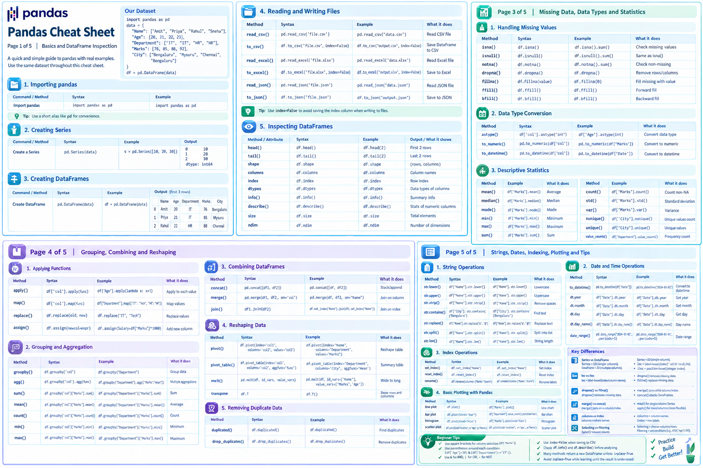

# Pandas Practice

My journey learning Pandas — from first principles to hands-on exercises,
with a cheat sheet I built along the way.

## Cheat Sheet



## Structure

```
notebooks/   lessons and exercises, numbered in learning order
docs/        exercise questions, review notes, and lessons learned
data/        raw dataset(s) used by the notebooks
assets/      cheat sheet and other visual references
```

## Setup

```bash
pip install pandas numpy jupyter
```

Open a notebook from `notebooks/` and run it from that folder — data paths
are relative (`../data/...`).

## Notebooks

| Notebook | What it covers |
|---|---|
| [`00_lessons_1_to_18.ipynb`](notebooks/00_lessons_1_to_18.ipynb) | Foundational lessons: Series, DataFrames, reading/writing files, inspection, selection, grouping, strings, dates |


